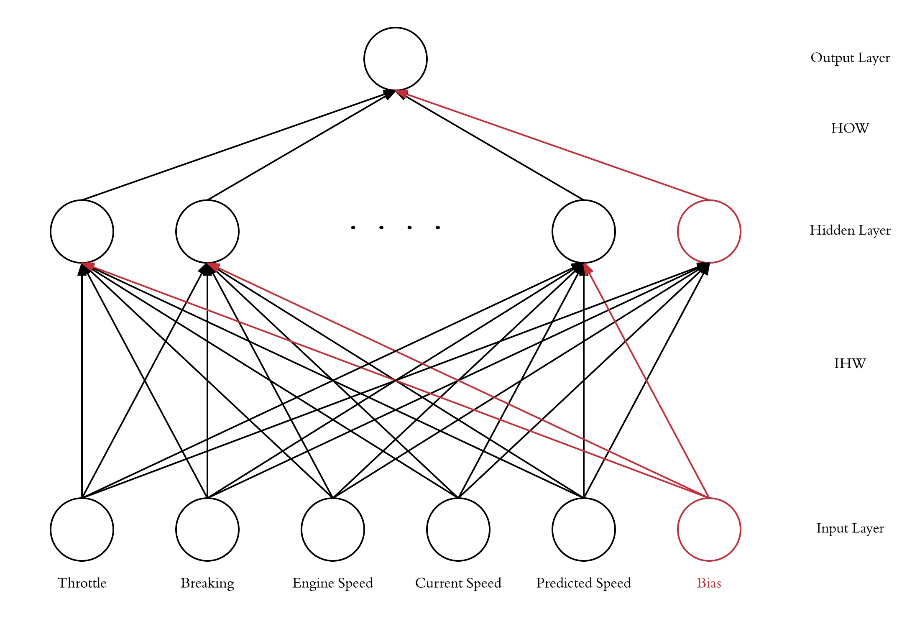

[Take me back to the home page!](/index.md)

## Undergraduate Research: Future Horizon Vehicle Velocity Estimation Using Artificial Neural Networks

My six weeks of research in the Control and Power Reasearch group at Imperial College were done under supervision of Dr. Simos Evangelou. I have been working on expanding a project that had already started the same year, on Future Horizon Vehicle Velocity Estimation using Artificial Neural Networks. The development and implementation of the Network itself were done on MATLAB by an ex-master's student: Johan Tillmar. The network is briefly described in the reports available and illustrated below: 

  

ANN design and training were done without using MATLAB's machine learning functions.
My work was split into two sections: Training Method Testing (Analysis work) and Real-time ANN Operation Simulation (Programming). 
The first sub-project helped me get familiar with the network and ANNs in general (in a MATLAB environment). More specifically, my role was to identify and compare two ANN training methods (Standard Back Propagation algorithm & Levenberg–Marquardt algorithm) in terms of accuracy, speed, computational requirements etc. 
The second part of my summer research was focusing on simulating ANN operation on-board a moving vehicle. The ANN which was given to me had only been trained and tested on a given 100+ second drive cycle dataset. This would be considered off-line training, as opposed to online training which was our objective developing this ANN. My role here was to write MATLAB code to train and test the ANN continuously using incoming sensor data, simulating the self-learning behaviour of the system during driving. The script involved dataset sectioning, training/testing scheduling and parameter selection (for reasonable training time/output accuracy balance).

These few weeks have really helped me progress in planning and rigor working in an academic and professional environment. I was also able to work on a fascinating technology, applied to vehicle intelligence. This introduction to Machine Learning has really pushed my curiosity to learn more about it. I intend to extend my work on machine learning, through projects or academia. 

### Reference:

A [reference letter](/0001.jpg) has been written by Dr. Simos Evangelou on my research experience.

### Reports:
- Comparative study of various training methods for the application [[Paper](/Report_v2.pdf)]
- Continuous time operation simulation of the ANN onboard a vehicle [[Paper](/untitled-23.pdf)]

### Github:
Repo is available [here](https://github.com/TheoFranquet/UROP).
