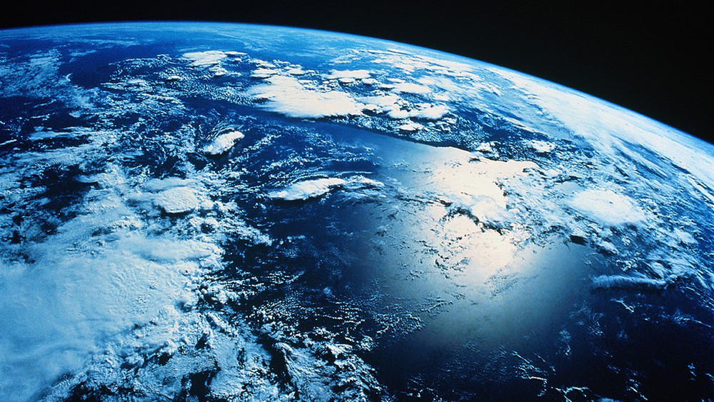

[Take me back to the homepage!](/index.md)

## The role of press in public environmental awareness

 
 
 The press in developed countries is undergoing unprecedented transformations in many aspects. Production and distribution strategies have been disrupted by the ever-changing technologies adopted by their readers. This has enabled press and media in general to re-shape their content to better address their target audience which is itself growing in diversity. News relating to the environment have recently become a topic of significant (although not major) interest for both writers and consumers in most developed countries. I have mentioned in the previous article that governments have the upper hand when it comes to executing transition to reducing emissions, something I still stand by, although the importance of press is also not to be undermined. This time around, we will be reviewing the role of press and media in affecting public opinion on environmental issues. 

Smartphone ownership is getting close to saturation in most developed countries, appealing to all ages and backgrounds. Significant research has been done on the changing behavior of readers.
The number of readers is subject to overall increase thanks to the internet and 89% of smartphone users consume press over the internet on their phone in the US [Nielsen, Sept 2015]. When it comes to environmental articles, their presence in news platform has slightly increased in the past decade. A study by the guardian on their hundred most popular articles between 2010 and 2014 has pointed out that two of the guardian’s 100 most popular articles write about environmental issues. Similarly sports and culture oriented topics also have two articles in this top 100, dominated by International news articles (34%).

### Reach and popular topics

A few environmental issues are regularly being covered by press while others are being left untouched. Popular topics include nuclear energy and risk (e.g. Closure of old plants & Fukushima Accident), polluting agricultural practices, urban air pollution spikes as well as the renowned yearly “hottest year ever recorded”. Consequences of this coverage are quite simple: mainstream opinion is mostly aware and concerned about these issues over others. An interesting observation here is that the average reader is not in a position to act directly on and impact most of these issues. On one hand, such distant content proves to be sensible: 1) the role of the press is to objectively relate important news (national/international scale) 2) the biggest emitters are often exclusively industrials as opposed to regular households. On the other hand, readers are regular consumers more than representatives of the business they work in, limiting how they can be influenced to change behavior for the better. Perhaps articles on household level issues should become more frequent in mainstream press in order to induce something else than just awareness to readers and actually have a direct impact on reducing environmental impact, whatever the issue might be. One might say that this is a subjective matter and that press should not be pushing its readers to act a certain way. However, news at a household level can be related as objectively as at they are currently being offered, looking at a larger scale. It is also hard for readers to feel the need to take actions if the issue seems too distant in time (e.g. half a century away) and space (e.g. Antarctica wildlife). Sure, these types of issues are real and important but news relating to the consumer’s everyday lifestyle and environment seem to be much more effective in inducing in the reader the need to make a difference.

### Presence in social media

Coming back to the increasing number of readers coming from internet expansion, it should also be noted that most readers use social media to consume news and media in general. This is central as news on social media completely altered how they are formulated. Articles are reduced to a title and an image or short video as consumers look to spend a minimum amount of time on each element available on their feed (twitter, facebook etc.). The obvious example is Twitter. For me Twitter has completely revolutionized the press landscape with quick and short news headlines on any topic, courtesy of the reader. Although this kind of distribution does have some positive aspects (quick, user can choose his sources, overcoming media censorship etc.) quality of news seems to be gradually degrading. News channels are looking to gather disproportionate reactions and interest from social media’s “fast readers” in order to forge their income and tend to produce and distribute news as often as possible, using somewhat shocking or exaggerating phrases as article titles, following the latest topic trends. Alongside all other news, professional environmental news coverage suffers from this model. One advantage using social media as a news platform however, is the mass sharing of small scale initiatives and news being made in the environmental sector notably. This type of content is too insignificant to be covered by large news agencies, but manage to surface user social media feeds thanks to recommendation based content for example.

### Sourcing scientific information

Environmental issues are still very new and consequences of humankind’s activity on earth is relatively uncertain. Most articles on these topics start by referring to the usual “expert study from university α show that…”. This method of submitting information to readers has a very negative impact on the quality of the content from a consumer’s perspective. This lazy habit simply has to stop. When it comes to scientific matters, rigor does not limit itself to the paper content but should also be adopted when quoting and summarizing it in a press article. Far too many articles spread unreliable news on dangers of a certain new technology in renewables & environmental sciences. This greatly affects public opinion creating fear and rejection of recent technologies such as nuclear and solar energy and electric vehicles, and looking to stick to older polluting technologies. In my opinion, a quoted paper must be readily accessible to the user while reading the article (as opposed to a simple quote in size 5 fonts at the bottom of the page). The diverse and repetitive landscape of scientific papers nowadays should also enable the press to quote several papers per issue to bring more substance and accuracy to their articles.

### Optmimism vs. Hopelessness

Another point of interest is the way most environmental news are being delivered. Regardless of the topic, the press usually writes its articles using an alarming, negative and somewhat hopeless tone. Of course, some of these issues deserve to be qualified as such, with new records of destruction being set yearly across the board. However, this type of article tends to induce guilt and fear within readers and it is of human nature to withdraw from these problems to try and re-orient their thinking to something more joyful to simply feel better.  The press and the media need to change the way they talk about climate change. These media sources should inject more positivity in their content to try and get their message across. Countless initiatives are started every day by very passionate people across the globe to counter humankind’s negative impact on the environment. Movies and documentaries are already starting to exploit these stories as opposed to mainstream press. Targeted, inspiring and positively oriented news would greatly improve the way articles are consumed and interpreted by the readers. Again, human nature will push someone to replicate what someone else has done successfully, especially for the common good. 

### Conclusion

Press and media in general constitute an immense force behind the transition to an environmentally sustainable world. Environmental issues have become increasingly available to consumers, in various forms: press articles, social media posts and even cinema. These changes have already begun to form certain opinions within readers of most developed countries. These ideas then directly impact individual and community lifestyle and whether effort is being made to solve pressing environmental issues. With such important responsibilities, press needs to guarantee the objectivity, diversity and more importantly the accuracy of the news they distribute relating to environmental issues. The objective is to encourage and empower “greener” initiatives for their readers and a good balance between large and small scale environmental issues is required to increase chances of a positive impact. More positivity in news and topics chosen would also spur more enthusiasm in readers to change their behavior for the best.  
