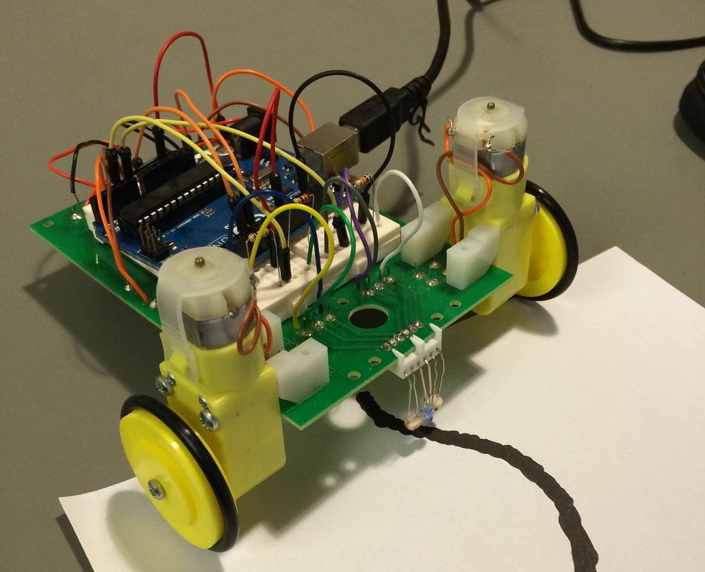
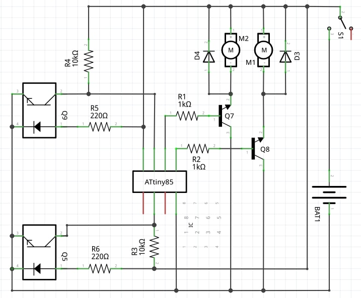

[Take me back to the homepage!](/index.md)

## EEbug project

  
 
My first year project at Imperial College aimed at introducing me to basic breadboard circuitry design, sensor integration and general project management. The project, tackled by teams of 6, consisted of designing and building a "small electric car" prototype able to follow any black line drawn on a surface. After reaching the end of the line, the robot had to be able to do an inward spiral before ultimately stopping. The team was handed out a budget and basic passive circuitry components alongside a set of restrictions for the design. 

### Hardware design & Sensors

The hardware is build around a cheap an programmable microcontroller, the ATtiny. The microcontroller is Arduino compatible, allowing easy and quick firmware development. More on that later. Ditigal output pins were used to drive simple amplifier circuits and power the two motors. This digital approach made the system more reliable and easier to debug. The device is powered by two 5V double A batteries. 
In order to "see" the black line, a pair of infrared emitter/sensors are used, one for each trace edge. These sensors modulate output voltage, which is subsequently read by the microcontroller. Below is the circuit schematic:

  

### Firmware development

The ATtiny is programmed using C. Simple routines are setup to process the incoming sensor data and output a certain voltage using PWM to drive each motor individually. The code also takes care of timing out when the trace is over and start the spiral using timers and counters. The firware itself is very straight forward, but this was a good introduction to Arduino programming and demo day performance was successful.
