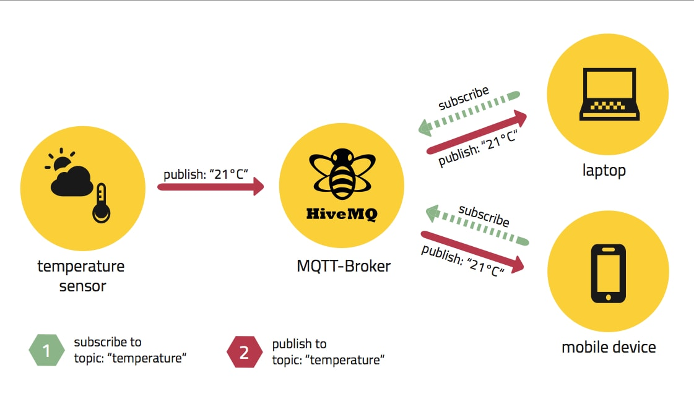
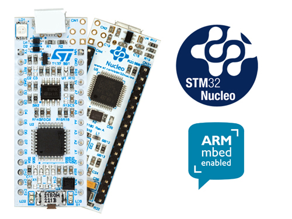

[Take me back to the homepage!](/index.md)

## Connected greenhouse climate control and monitoring: CLIM.8 

This 3rd year project focused on mastering elementary microcontroller programming, sensor integration and wireless MQTT protocol usage. The 4 student team I was part of decided to develop a greenhouse climate and light intensity control system, controlable by a remote device through connection to an MQTT broker. 

   

This project is developed in python. It involves establishing I2C communication with two simple adafruit sensors, and JSON message formatting for communication with the MQTT broker. The broker is also subsribed to the user's device, where climate parameters can be customized. The code used is available on this [github repo](https://github.com/guigzzz/Embedded-Project).

   
