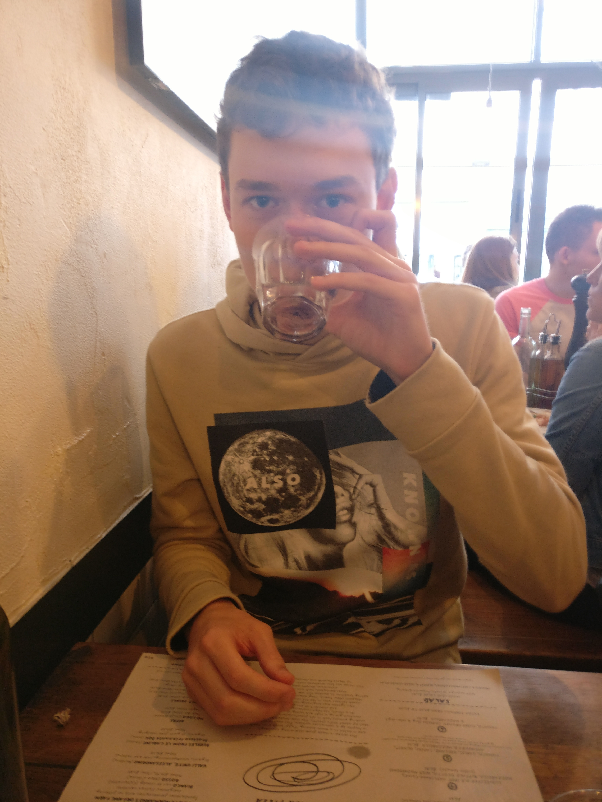

[theofranquet@outlook.com](mailto:theofranquet@outlook.com) 
[Curriculum Vitae](/CV.pdf)


I am currently an Electrical and Electronic Engineering (EEE) undergraduate student in Imperial College London, with big amitions to work on challenging and meaningful projects through various applications in my field. I invite you to explore the rest of this page to learn more about some of my works in the past few years and read on my technical educational background.


### Hardware
- VHDL programming: 

### Firmware & Software
- Real time digital signal processing: Speech enhancement project
- Embedded system using MQTT connectivity protocol: Connected greenhouse climate monitoring and control device (prototype)
- Embedded system for high precision motor control
- Connected thermostat prototyping (Head of team of 7 students)


### Research
I have undergone undergraduate research in the summer of 2016 at Imperial College London's Control and Power research group on future horizon velocity estimation using artifical neural networks:

- Comparative study of various training methods for the application
- Continuous time operation simulation of the ANN onboard a vehicle

Repo is available here.


### Education
I am one year away of obtaining an Meng in EEE at Imperial College London. Recent courses taken (3rd year) belong to the fields of:
- Power and Energy Systems
- Embedded Systems
- Artifical Intelligence & Machine Learning
- Control Systems and Linear Algebra


### Work Experience
#### Semiconductors Industry
I have worked 3 months at ST Microelectronics Singapore over the summer of 2015, my work there involved:
1) Manufacturing of Bipolar Devices 
2) Manual device failure analysis
3) Training material establishement

#### Renewables & Energy Storage Industry
My industrial placement, undergone in conjunction with Imperial College London, is spent working for 6 months at Natron Energy (formerly Alveo Energy), in Santa Clara, CA. Natron Energy is a battery start up introducing revolutionary low cost energy storage solutions using a new cell technology based on inexpensive Prussian blue analogue electrodes and a sodium-ion electrolyte. My work here includes:
1) Integral Battery Management System (BMS) development for UPS application
2) PCB design
3) Firmware development for power critical application
4) Battery state estimation algorithm R&D


```markdown
Syntax highlighted code block

# Header 1
## Header 2
### Header 3

- Bulleted
- List

1. Numbered
2. List

**Bold** and _Italic_ and `Code` text

[Link](url) and 
```


For more details see [GitHub Flavored Markdown](https://guides.github.com/features/mastering-markdown/).

### Jekyll Themes

Your Pages site will use the layout and styles from the Jekyll theme you have selected in your [repository settings](https://github.com/TheoFranquet/TheoFranquet.github.io/settings). The name of this theme is saved in the Jekyll `_config.yml` configuration file.

### Support or Contact

Having trouble with Pages? Check out our [documentation](https://help.github.com/categories/github-pages-basics/) or [contact support](https://github.com/contact) and we’ll help you sort it out.
