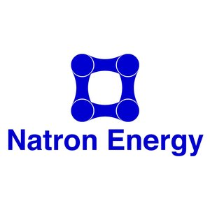

   

[Curriculum Vitae](/CV.pdf) & [LinkedIn](https://www.linkedin.com/in/theo-franquet-1b7097b3)

[Email](mailto:theofranquet@outlook.com)


I am currently an Electrical and Electronic Engineering (EEE) undergraduate student at Imperial College London, with big ambitions to work on challenging and meaningful projects through various applications in my field. I invite you to explore the rest of this page to learn more about some of my works in the past few years and read on my technical educational background.
My focus at this stage is aimed at sustainable energy systems applications and machine learning.

My main objective as an engineer is to participate in improving quality of life for the people in need, while ensuring a viable future for the generations to come. I mean it!


## :electric_plug: Hardware & Robotics
-  Line following robot [[Learn more](/eebug.md)]
- Connected thermostat prototyping (Head of team of 7 students) [[Learn more](/glow.md)]


## :computer: Firmware & Software
- Real time digital signal processing: Speech enhancement project [[Learn more](/RTDSP.md)]
- Embedded system using MQTT connectivity protocol: Connected greenhouse climate monitoring and control device (prototype) [[Learn more](/embedded.md)]


## :mag: Research
I have undergone undergraduate research in the summer of 2016 at Imperial College London's Control and Power research group on future horizon vehicle velocity estimation using artificial neural networks [[Project Description](/UROP.md)]: 

- Comparative study of various training methods for the application [[Paper](/Report_v2.pdf)]
- Continuous time operation simulation of the ANN onboard a vehicle [[Paper](/untitled-23.pdf)]

Repo is available [here](https://github.com/TheoFranquet/UROP).


## :mortar_board: Education
I am one year away of obtaining an Meng in EEE at Imperial College London. Recent courses taken (3rd year) belong to the fields of:

**- Electrical Energy Systems**

```
Grid scale load flow analysis (Gauss-Seidel method...)
Fault analysis (Single/Three phase system, Balanced/Unbalanced fault)
```
**- Embedded Systems**

```
Sensor to/from Microcontroller communication (I2C) and programming
Sending/Receiving data to/from MQTT broker
JSON message formatting
Writing efficient and maintainable firmware
Interrupt based firmware (in C)
Basic control algorithm implementation
Scheduling and dependency analysis
```
**- Artifical Intelligence & Machine Learning**

```
AI:
Declarative programming (Prolog)
Search algorithms (e.g. two player games)
Formal logic
Knowledge representation and automated reasoning

ML:
Perceptron Learning Algorithm for handwritten digit classification
Linear Regression
Ridge Regression
Gradient Descent
Structural Risk Minimization
Feature transformation
Cross Validation
SVMs
PCA
```
**- Control Systems and Linear Algebra**

```
Linear Algebra (complete MIT 18.06 content)
State Space system representation
System Trajectory, Motion, Equilibrium and Stability analysis
Reachability and Controllability
Observability and Reconstructability
Design tools
```

## :briefcase: Work Experience
### Semiconductors Industry

   

I have worked for 3 months for *ST Microelectronics Singapore* over the summer of 2015, my work there involved:

- Manufacturing Engineering for Bipolar Devices 
- Manual device failure analysis
- Training material redacting

### Renewables & Energy Storage Industry

   

My industrial placement, undergone in liaison with Imperial College London, is spent working for 6 months at *Natron Energy* (formerly Alveo Energy), in Santa Clara, CA. Natron Energy is a battery start up introducing revolutionary low cost energy storage solutions using a new cell technology based on inexpensive Prussian blue analogue electrodes and a sodium-ion electrolyte. My work here includes:

- Integral Battery Management System (BMS) development for UPS application
- Altium PCB design & debugging
- Firmware development & debugging for power critical application
- Battery state estimation algorithm R&D
- SPI communication development
- Test automation
 
## :memo: Personal Writing  
A mix of curiosity and ambition towards the transition to sustainable energy production and management in today’s society has led me to start writing a collection of 3 short articles on the topic of renewable energy integration and dynamics in the non-scientific world. A lot of technological ground has been covered in the sector of fossil fuel alternatives. However, it is only now that those technologies are starting to attract major interest of governments, research groups and financial investments thanks to an increasing combination of mainstream environmental concern, technology affordability and scientific advances. These three articles will give an insight on the political, mediatic and financial facets of the matter.

- Environmental commitment in politics [[Read](https://medium.com/@tfranquet852/environmental-commitment-in-politics-681a2bc3c5ef)]
- The role of press in public environmental awareness [[Read](https://medium.com/@tfranquet852/the-role-of-press-in-public-environmental-awareness-bca2598afa5a)]
- Environmental effort and economic prosperity [Under Construction]


